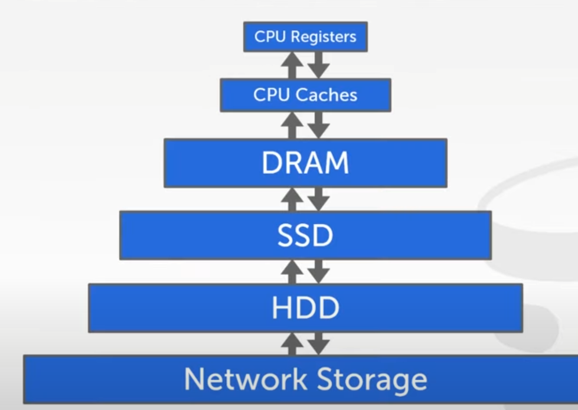

### Lecture 3

The 2021 lectures have some audio issue. So I'm watching the same lecture from 2019.

We are introduced with Storage Hierarchy.

We observe that Storage above DRAM is volatile and below that is Non-volatile. The read write speeds also decrease as we go down the pyramid. Each has their pros and cons. There are new inventions in Non-Volatile RAMs which will be beneficial for all humankind. The speed of RAM and persistence of ROM combined will be a game changer.

Moving Forward, We are aware that Databases must absolutely have persistence. And as we go down the pyramid, we observe all devices that offer persistence are shit slow. The solution in the future? NVRAMs. The solution now? Deal with it.

### Disk Oriented DBMS

**Page:** In order to read a file from Disk we have to read the entire 4kb page and then access the data from that page. Any changes has to be in the page buffer and the entire page is written to the disk. This point should be remembered as this points us to a consideration to keep individual reads and writes to a minimum. If required, it is efficient to read and write data in large blocks rather than byte level.

But why are we talking about memory management? Can't the OS figure that out?/
The answer is Yes. The OS can do all the memory management thing but it is extremely inefficient. If we are using OS calls like `mmap`, we are losing control over the entire memory management process.

Therefore, there are not a lot of popular DBMS that use OS to manage memory. Those who do significantly underperform against the ones who don't.

We are left with 2 problems.

1. How are we going to store our data on disk?
2. How are we going to manage the constant back-and-forth from disk.

