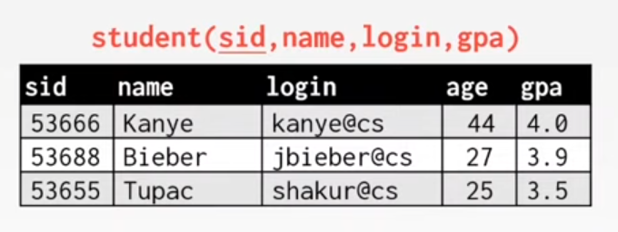
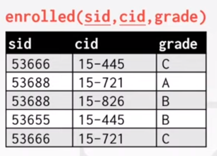
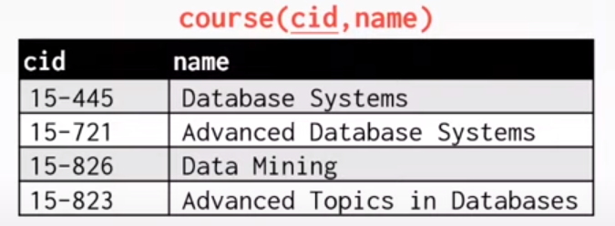

## Lecture 1

> I forgot to blog my notes for Lecture 1 and I'm not planning to do so in the near future. The lecture covered basic topics like coursework and database basics. Relational Algebra notations and a few examples of those notations being used. I will blog them out if I feel the need to. 

## Lecture 2

Lecture is on Intermediate SQL.\
At a high level, SQL is broken down into 3 Languages

- Data Manipulation Language (DML) - for manipulating data
- Data Definition Language (DDL) - for manipulating structure of data
- Data Control Language (DCL) - for access control and security

Note: SQL is based on multisets or bags not sets. SQL allows duplicate data and stores them as different tuples.





And now, we are going to write some queries to fetch particular details.

- Get names and GPAs of all students older than 25.

```SQL
SELECT name, gpa FROM student WHERE age > 25;
```

Here is the Relational Algebra notation for the above problem
)

- Which students got an A in 15-721?

```SQL
SELECT student.name FROM enrolled, student WHERE enrolled.grade = 'A' AND enrolled.cid = '15-721' AND student.sid = enrolled.sid
```

### Aggregates

1. AVG(col)
2. MIN(col)
3. MAX(col)
4. SUM(col)
5. COUNT(col)

- Get # of students with a '@cs' login

```SQL
SELECT COUNT(login) FROM student WHERE login like '%@cs';
```

- Get average gpa and # of students that have a '@cs' login

```SQL
SELECT AVG(gpa), COUNT(*) FROM student WHERE login like '%@cs';
```

- Get # of unique students that have '@cs' login

```SQL
SELECT COUNT(DISTINCT name) FROM student where login like '%@cs';
```

- Get average GPA of students in each course

```SQL
SELECT AVG(s.gpa), e.cid FROM enrolled AS e, student AS s WHERE e.sid = s.sid GROUP BY e.cid;
```

### Non Trivial Operations

#### 1. Date/Time Operations

- To manipulate and modify Date/Time attributes.
- Get # of days since new year
  
```SQL
SELECT NOW() - DATE('2024-01-01') AS days;
```

If `NOW()` doesn't work, we can use `CURRENT_TIMESTAMP` depending on the implementation.

#### 2. Output Redirection

- Store query results in another table.

```SQL
SELECT DISTINCT cid INTO CourseIds FROM enrolled;
```

- Insert tuples into another table

```SQL
INSERT INTO CourseIds (SELECT DISTINCT cid FROM enrolled);
```

#### 3. ORDER BY

- Order the output tuples by the values in one or more of their columns.

```SQL
SELECT sid, grade FROM enrolled WHERE cid = '15-721' ORDER BY grade;
```

#### 4. LIMIT

- Limit number of tuples returned in output
- can offset

```SQL
SELECT sid, name FROM student WHERE login LIKE '%@cs' LIMIT 10 OFFSET 2;
```

#### 5. Nested Queries

- Queries within queries

```SQL
SELECT name FROM student WHERE sid in (SELECT sid FROM enrolled);
```

- Q. Find student record with highest id that is enrolled in atleast one course.

```SQL
SELECT sid, name FROM student WHERE sid IN (SELECT MAX(sid) FROM enrolled);
```

- Q. Find all courses that have no students enrolled in it.

```SQL
SELECT * FROM course WHERE NOT EXISTS (SELECT * FROM enrolled WHERE course.cid = enrolled.cid);
```

And that is all for Lecture 2. Honestly, I had to complete the video in multiple sittings. SQL is just not that interesting on it's own. But I'm sure building a DataBase will be more fun than this.

Next post might be BYOD Chapter 1 or the CMU Assignment 1. I'll see what I feel like doing after a quick nap.