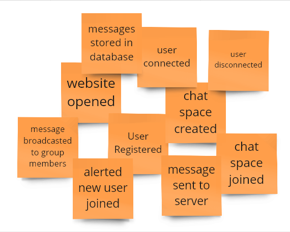
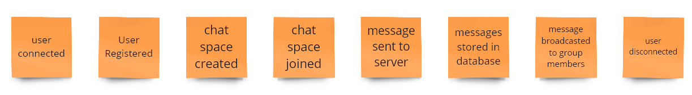
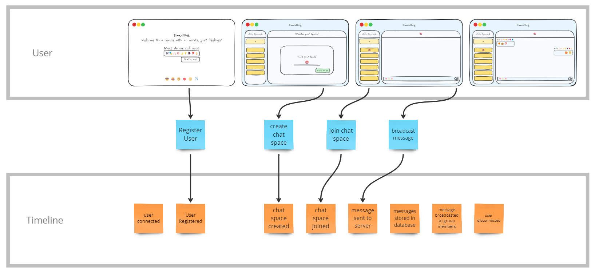
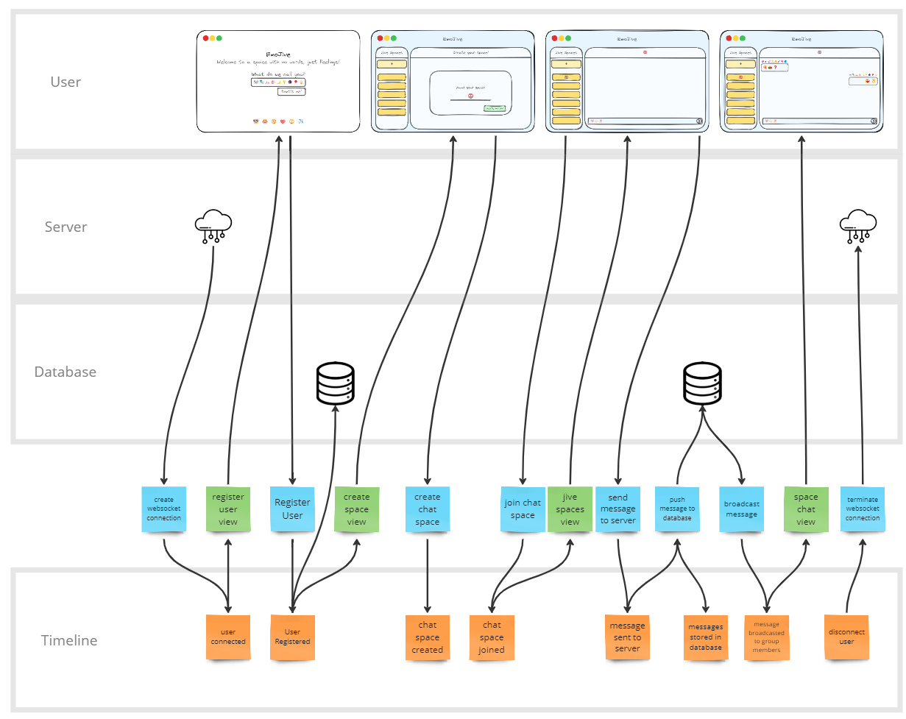
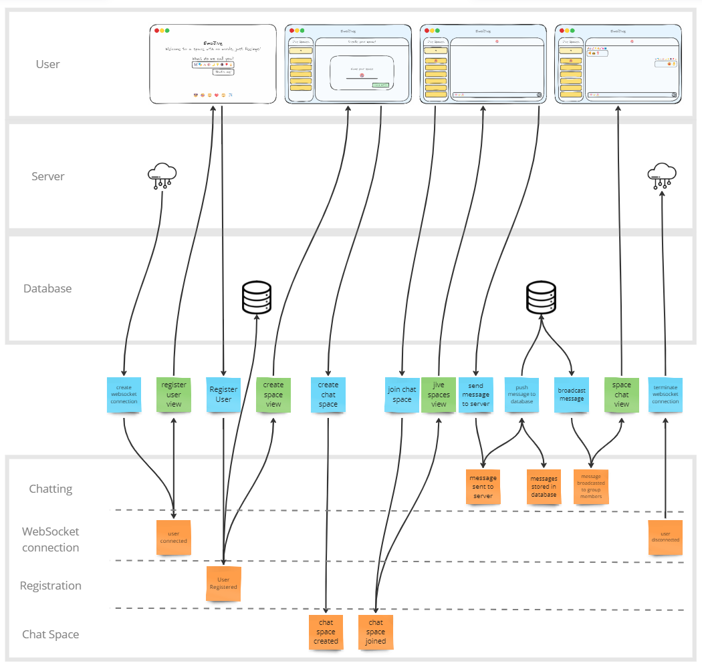
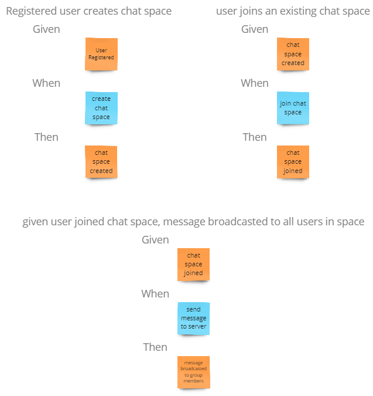

## What is Event Modeling?

Event Modeling is a powerful technique for describing the behavior of any system over time. It involves creating a timeline or narrative that outlines the system’s journey from inception to completion. During this timeline, we meticulously capture all the essential steps taken by the system.

The primary purpose of event modeling is to track the flow of information throughout this timeline. It encompasses everything from user inputs via the UI to data storage in databases and the generation of analytical reports. By visualizing this flow, we gain insights into how the system processes and transforms information at different stages.

Rather than getting bogged down in transient details, Event Modeling focuses on durable changes in the system. It identifies key events that shape the system’s behavior at different points in time. By emphasizing state over intricate logic, Event Modeling allows us to understand what the system is doing without drowning in implementation minutiae. It extends the concept of “specification by example” into the realm of system design.

Notably, Event Modeling draws inspiration from the work of industry experts such as Eric Evans (Domain-Driven Design), Martin Fowler (Event Sourcing), Greg Young (Command Query Responsibility Segregation), and Alberto Brandolini (Event Storming).

To familiarize with this process, we are going to build the Event modelling diagram of a real world system. Let's build one for EmoJive. A real time chat application but only using emojis. 

You can view the finished Event Modelling diagram for EmoJive [here](https://miro.com/app/board/uXjVN48oIbY=/?share_link_id=237340155809).

## 7 Steps to Perform Event Modeling

#### 1. Brainstorming

We begin by discussing the **business goals** of the system. We want to understand the system's intent and how it should behave. We can capture all possible events in the system's timeline. We must also ensure that only **state-changing events** are be specified. These events capture significant transitions in the system.
Explore all possible events that could occur during the execution of an existing business process. Note these events on orange sticky-notes. We want to add, modify or remove events as new insights emerge. Remember that an event represents a **fact** occuring in the domain. Events are the source of truth, and we can derive the system's current state from them. They are **immutable** and represent essential business facts.

To build EmoJive, we can think of some events that might occur in our application. Note that in this step we must focus on writing down as many events as possible and keep them business oriented. We write down these events on a orange sticky note. 

#### 2. **The Plot / Timeline**

The next step is to form a story from these events by arranging them in cronological order, creating a sequence of events that describes our system. During this step, we gain further insights for missing events and removing non state-changing events become evident. Run through the story from both sides to make sure the events make sense.

We can start by removing non-business events from our pile. Events such as `website opened` and `alerted new user joined` do not carry much business value. Here is the sequence of events in the following manner: a user connects to our system, and a WebSocket connection is established. The user can provide us with a username in the `User registered` event. Next, the user creates a chat space and joins it. They send a message in the chat space, which is received by our server and stored in a database. This message is broadcasted to all the members in the chat space. After an engaging emoji battle, the user disconnects.

#### 3. **The Storyboard**
We add the UI/UX elemtents in this step. We must remember that good user experience is necessary for good business. We can incorporate good user experience by incorporating it during the planning phase itself. In this phase, we create mockups, wireframes or entire UI designs(if time permits). For systems involving multiple users, we delineate their roles by separating the UI/UX of each user into different swimlanes.

I have designed some mockups. The first represents the user registration page. Here, the user will enter a sequence of emojis representing you. The second represents the UI for creating a new space. The third mockup represents the UI of a space without any messages. The fourth represents a space after a few chats.

#### 4. **Identify Inputs**
In this step, we enable users to change the system's state. We use blue sticky notes to represent a user's action. We include input forms and buttons in the mockups and identify the commands sent to the system for processing. Thus, we are linking an event to the UI through a command. These commands act as bridges between user interactions and the underlying system.

It's clear how users can interact with our system. In the initial mockup, when a user clicks the 'that's me!' button, it triggers a command. Let's call this command 'register user' and note it on a blue sticky note. We'll do the same for all the other user inputs.

#### 5. **Identify Outputs**
In this step, we need to connect the accumulated information and the UI using views, also known as read-models. Views are crucial in the system, empowering users to make informed decisions and invoke the correct commands. To represent a view, we use a green sticky note. It is essential to display only the necessary information, minimizing noise.

Introducing another critical pattern in software architecture, Command Query Responsibility Segregation (CQRS). CQRS is a pattern that segregates read operations from command operations. This approach fosters loose coupling, enhances predictability, and facilitates easier scaling, optimizations, and architectural changes.

By adopting CQRS, we can streamline the system's structure and promote a more efficient and scalable design. The separation of command and query responsibilities leads to a clear and more maintainable architecture, supporting better adaptability to future changes.

We've made several changes in this step. Two additional lanes added for the services we use. As we understand our systems better, we intentionally introduced more commands to reveal its inner workings. This process forces the extraction of the tiniest pieces of the system.

#### 6. **Apply Conway’s Law**
Now that we comprehend how information flows into and out of our system, let's organize the events themselves into swimlanes. This step enables the system to exist as a collection of autonomous parts, each of which can be owned by separate teams. By doing so, we can maintain control over specialization levels, preventing fragmentation across teams.

Defining system components involves grouping events into swimlanes, ensuring that each swimlane possesses maximum autonomy and can be owned by a separate team. This approach facilitates a more streamlined and efficient development process, allowing teams to focus on specific components without unnecessary overlap or interference.

We've organized our events into different swimlanes. The `user connected` and `user disconnected` events are grouped under `WebSocket connection`. Similarly, we have swimlanes dedicated to `Chatting`, `Registration`, and `Chat Space`. This organization enhances the separation of concerns among teams and reduces coupling.

#### 7. **Elaborate Scenarios**
This step essentially enables us to convert the story into an actionable specification. The familiar Give-When-Then or Given-Then specification can be formulated easily in a short amount of time. What's very critical here is that each specification is tied to exactly one command or view.

By ensuring that each specification is associated with a specific command or view, we establish clear and unambiguous guidelines for the development process. This targeted approach enhances the clarity of responsibilities and contributes to a more effective implementation of the system's functionalities.    

This step is the final outcome of our efforts. We now have a visual diagram to understand our specifications. I've listed a few below, and we can create many more such specifications to develop acceptance tests.

We experienced the event modeling process and observed how it assisted us in creating the timeline for our system. This approach compelled us to consider scenarios that we might have overlooked without using this pattern. With a well-defined set of specifications and our project divided into small chunks, we can efficiently distribute these tasks to teams. They can work in parallel without overlap or the need for rework.