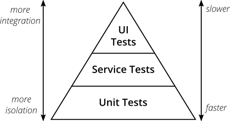

## What happened?

I stumbled upon this book and thought to myself, let's make a deal I am going to finish this book no matter what and I am going to finish it all the way through. And I had a deadline. 2023. I had a little more than 2 months to finish the book which should be more than enough theoritically. But I just had to make sure I don't give up midway. 
This will be a compilation of all the things I learnt and all the things I'm going to likely forget. So instead of working my way to the actual book, I want to get to the crux fast.



## [Hello World](https://quii.gitbook.io/learn-go-with-tests/go-fundamentals/hello-world)

Let's start with the ceremony. 
* `fmt` package allows us to use a bunch of functions like `Print_()`, `Sprint_()` and `Fprint_()`. These come to use all the time. 
* We are met with our first iteration of TDD. Write failing tests -> Pass the test though the easy path -> Refactor!
* This is the smallest piece of example to highlight the TDD process. 
    Write failing test
    ```Go
    // hello_test.go
    package main
    import "testing"
    func TestHello(t *testing.T) {
        got := Hello()
        want := "Hello, world"
        if got != want {
            t.Errorf("got %q want %q", got, want)
        }
    }
    ```
    Passing test through easy path
    ```Go
    // hello.go
    package main
    import "fmt"
    func Hello() string {
        return "Hello, world"
    }
    func main() {
        fmt.Println(Hello())
    }
    ```
    Refactor
    ```Go
    package main
    import "fmt"
    const GreetMessage = "Hello, world"
    func Hello() string {
        return GreetMessage
    }
    func main() {
        fmt.Println(Hello())
    }
    ```

## [Integers](https://quii.gitbook.io/learn-go-with-tests/go-fundamentals/integers)
* This was just to show that we can do maths in Go
* To install godoc use this `go install golang.org/x/tools/cmd/godoc@latest`
* Writing Examples for godoc 
    ```Go
    // adder_test.go
    func ExampleAdd() {
        sum := Add(1, 5)
        fmt.Println(sum)
        // Output: 6
    }
    ```
    ```Go
    // This is the overview
    package numbergame
    // Takes 2 integer numbers and returns the sum of them
    func Adder(num1, num2 int) int {
        return num1 + num2
    }
    ```
* The `// Output: 6` is required to be formatted as the output of the example. And the name `ExampleXXX()` is equally important to be registered as an example to show in the godoc. 
* Comment above the package is interpreted as Overview of package
* Comment above each function is the description of each function.
* Allows better documentation. I promise I will make my code documentation proof whenever I write anything.

## [Iteration](https://quii.gitbook.io/learn-go-with-tests/go-fundamentals)
* This chapter taught me benchmarking. 
    ```Go
    func BenchmarkRepeat(b *testing.B) {
        for i := 0; i < b.N; i++ {
            Repeat("a")
        }
    }
    ```
* To run this benchmark `go test -bench=.` 
* When the benchmark code is executed, it runs b.N times and measures how long it takes.
    ```bash
    goos: linux
    goarch: amd64
    pkg: GoSayHello/03_Iteration
    cpu: AMD EPYC 7763 64-Core Processor                
    BenchmarkLoopy-2          257878              5591 ns/op
    PASS
    ok      GoSayHello/03_Iteration 2.410s
    ```
* Our function gives a performance of 5591 ns/op and it ran the function 257878 times.
* Another example from the book from the Concurrency chapter.
    ```Go
    func BenchmarkCheckWebsites(b *testing.B) {
        urls := make([]string, 100)
        for i := 0; i < len(urls); i++ {
            urls[i] = "a url"
        }
        b.ResetTimer()
        for i := 0; i < b.N; i++ {
            CheckWebsites(slowStubWebsiteChecker, urls)
        }
    }
    ```
* We can use `b.ResetTimer()` to start counting from that instant. More in [Concurrency](#concurrency) Chapter.


## [Arrays and Slices](https://quii.gitbook.io/learn-go-with-tests/go-fundamentals/arrays-and-slices)
* There are two ways to declare an array in Go
    * [N]type{value1, value2, ..., valueN} e.g. numbers := [5]int{1, 2, 3, 4, 5}
    * [...]type{value1, value2, ..., valueN} e.g. numbers := [...]int{1, 2, 3, 4, 5}
* We can traverse through array with the `range` keyword.
    ``` Go
    func Sum(numbers [5]int) int {
        sum := 0
        for _, number := range numbers {
            sum += number
        }
        return sum
    }
    ```
* Arrays are strict
    > An interesting property of arrays is that the size is encoded in its type. If you try to pass an [4]int into a function that expects [5]int, it won't compile. They are different types so it's just the same as trying to pass a string into a function that wants an int.
* Thus we use Slices, `[]int{1,2,3}`
* Coverage. `go test -cover`
    >Go's built-in testing toolkit features a coverage tool. Whilst striving for 100% coverage should not be your end goal, the coverage tool can help identify areas of your code not covered by tests. If you have been strict with TDD, it's quite likely you'll have close to 100% coverage anyway.
* Variadic Functions
    > Variadic functions can be called with any number of trailing arguments

    ```Go
    func SumAll(numbersToSum ...[]int) []int {
        lengthOfNumbers := len(numbersToSum)
        sums := make([]int, lengthOfNumbers)

        for i, numbers := range numbersToSum {
            sums[i] = Sum(numbers)
        }

        return sums
    }
    ```
    `make` allows us to create a new slice of the `[]int` datatype and `lengthOfNumbers` length.

*  `reflect.DeepEqual`
    > Go does not let you use equality operators with slices. You could write a function to iterate over each got and want slice and check their values but for convenience sake, we can use reflect.DeepEqual which is useful for seeing if any two variables are the same.

## [Structs, methods & interfaces](https://quii.gitbook.io/learn-go-with-tests/go-fundamentals/structs-methods-and-interfaces)

* Struct
    > We can create a simple type using a struct. A struct is just a named collection of fields where you can store data.
    
    ```Go
    type Rectangle struct {
        Width  float64
        Height float64
    }

    func (r Rectangle) Area() float64 {
        return r.Width * r.Height
    }

    type Circle struct {
        Radius float64
    }

    func (c Circle) Area() float64 {
        return math.Pi * c.Radius * c.Radius
    }
    ```
    We can declare these functions for the given struct which gives us a kind of OOP functionality. Thus we can give a property to our datatype. We have declared that we have two shapes `Rectangle` and `Circle`. Each of those shapes will have a method `Area`. 
* Interfaces
    > Interfaces are a very powerful concept in statically typed languages like Go because they allow you to make functions that can be used with different types and create highly-decoupled code whilst still maintaining type-safety.
    * `My type Foo implements interface Bar` means `type Foo` will have all the methods mentioned in the `interface Bar` in the exact shape mentioned in the interface.
    * Declaring interfaces so you can define functions that can be used by different types (parametric polymorphism)

## [Pointers & errors](https://quii.gitbook.io/learn-go-with-tests/go-fundamentals/pointers-and-errors)
* When we create types, if we want to pass them around in a function as a parameter we have to make sure what we are sending.
    ```Go
    func X(MyStruct X, ...args) {
    }
    ```
    and
    ```Go
    func X(MyStruct *X, ...args) {
    }
    ```
    would mean completely different things as in the parameter X we are sending in the second function is the pointer to the original struct. Thus if our func is making any changes to the struct, it will most probably require a pointer as the parameter. If not, making changes to a copy of our struct seems useless.
* Stringer
    > Stringer is implemented by any value that has a String method, which defines the “native” format for that value. The String method is used to print values passed as an operand to any format that accepts a string or to an unformatted printer such as Print.

    ```Go
    package main

    import (
        "fmt"
    )

    // Animal has a Name and an Age to represent an animal.
    type Animal struct {
        Name string
        Age  uint
    }

    // String makes Animal satisfy the Stringer interface.
    func (a Animal) String() string {
        return fmt.Sprintf("%v (%d)", a.Name, a.Age)
    }

    func main() {
        a := Animal{
            Name: "Gopher",
            Age:  2,
        }
        fmt.Println(a)
    }
    ```
    
    | Output |
    | ------ |
    |Gopher (2)| 
* errors
    > errors.New creates a new error with a message of your choosing.

    ```Go
    if amount > w.balance {
		return errors.New("oh no")
	}
    ```
* Unchecked errors
    > Whilst the Go compiler helps you a lot, sometimes there are things you can still miss and error handling can sometimes be tricky.
    There is one scenario we have not tested. To find it, run the following in a terminal to install errcheck, one of many linters available for Go. \
    `go install github.com/kisielk/errcheck@latest`
    Then, inside the directory with your code run `errcheck .`

    This tells us what part of our code we have not tested. 

## [Maps](https://quii.gitbook.io/learn-go-with-tests/go-fundamentals/maps)
    > way to store items by a key and look them up quickly \

* Searching in a map
    ```Go
    definition, ok := d[word]
	if !ok {
		return "", errors.New("could not find the word you were looking for")
	}
    ```
* > A map value is a pointer to a runtime.hmap structure. \
    An interesting property of maps is that you can modify them without passing as an address to it (e.g &myMap)

* Create a custom error wrappers for your application, always.
    [check this out](https://dave.cheney.net/2016/04/07/constant-errors)

## Dependency Injection
> Our function doesn't need to care where or how the printing happens, so we should accept an interface rather than a concrete type.
If we do that, we can then change the implementation to print to something we control so that we can test it. In "real life" you would inject in something that writes to stdout.
* Under the hood `Printf` just calls `Fprintf` passing in `os.Stdout`.

```Go
package main

import (
	"fmt"
	"io"
	"os"
)

func Greet(writer io.Writer, name string) {
	fmt.Fprintf(writer, "Hello, %s", name)
}

func main() {
	Greet(os.Stdout, "Elodie")
}
```
we are passing a dependency, `writer io.Writer` as a parameter.

## [Mocking](https://quii.gitbook.io/learn-go-with-tests/go-fundamentals/mocking)

* Example 
    > We have a dependency on Sleeping which we need to extract so we can then control it in our tests.
    If we can mock time.Sleep we can use dependency injection to use it instead of a "real" time.Sleep and then we can spy on the calls to make assertions on them.

    ```Go
    type SpySleeper struct {
        Calls int
    }

    func (s *SpySleeper) Sleep() {
        s.Calls++
    }
    ```

    > I feel like if a test is working with more than 3 mocks then it is a red flag - time for a rethink on the design 

    > Use spies with caution. Spies let you see the insides of the algorithm you are writing which can be very useful but that means a tighter coupling between your test code and the implementation. Be sure you actually care about these details if you're going to spy on them

    > "When to use iterative development? You should use iterative development only on projects that you want to succeed." \
        - Martin Fowler

    > [TestDouble](https://martinfowler.com/bliki/TestDouble.html)

## [Concurrency](https://quii.gitbook.io/learn-go-with-tests/go-fundamentals/concurrency)
> An operation that does not block in Go will run in a separate process called a goroutine. Think of a process as reading down the page of Go code from top to bottom, going 'inside' each function when it gets called to read what it does. When a separate process starts, it's like another reader begins reading inside the function, leaving the original reader to carry on going down the page.

* Anonymous functions
    > Because the only way to start a goroutine is to put go in front of a function call, we often use anonymous functions when we want to start a goroutine. An anonymous function literal looks just the same as a normal function declaration, but without a name (unsurprisingly).

    ```Go
    package concurrency

    type WebsiteChecker func(string) bool

    func CheckWebsites(wc WebsiteChecker, urls []string) map[string]bool {
        results := make(map[string]bool)

        for _, url := range urls {
            go func() {
                results[url] = wc(url)
            }()
        }

        return results
    }
    ```

* race detector (ahem) and channels
    > Go can help us to spot race conditions with its built in race detector. To enable this feature, run the tests with the race flag: `go test -race`.

    > We can solve this data race by coordinating our goroutines using channels. Channels are a Go data structure that can both receive and send values. These operations, along with their details, allow communication between different processes.

    ```Go
    package concurrency

    type WebsiteChecker func(string) bool
    type result struct {
        string
        bool
    }

    func CheckWebsites(wc WebsiteChecker, urls []string) map[string]bool {
        results := make(map[string]bool)
        resultChannel := make(chan result)

        for _, url := range urls {
            go func(u string) {
                resultChannel <- result{u, wc(u)}
            }(url)
        }

        for i := 0; i < len(urls); i++ {
            r := <-resultChannel
            results[r.string] = r.bool
        }

        return results
    }
    
    ```

## [Select]()
* defer
    > By prefixing a function call with defer it will now call that function at the end of the containing function. \
    Sometimes you will need to clean up resources, such as closing a file or in our case closing a server so that it does not continue to listen to a port. \
    You want this to execute at the end of the function, but keep the instruction near where you created the server for the benefit of future readers of the code.

* Example
    ```Go
    func Racer(a, b string) (winner string, error error) {
        select {
        case <-ping(a):
            return a, nil
        case <-ping(b):
            return b, nil
        case <-time.After(10 * time.Second):
            return "", fmt.Errorf("timed out waiting for %s and %s", a, b)
        }
    }

    func ping(url string) chan struct{} {
        ch := make(chan struct{})
        go func() {
            http.Get(url)
            close(ch)
        }()
        return ch
    }
    ```
* Always make channels
    > Notice how we have to use make when creating a channel; rather than say `var ch chan struct{}`. When you use var the variable will be initialised with the "zero" value of the type. So for string it is "", int it is 0, etc.
    For channels the zero value is nil and if you try and send to it with <- it will block forever because you cannot send to nil channels

* Timeouts
    > Implement timeouts, wherever possible.

## [Reflect](https://quii.gitbook.io/learn-go-with-tests/go-fundamentals/reflection)

> The reflect package has a function ValueOf which returns us a Value of a given variable. This has ways for us to inspect a value, including its fields which we use on the next line. \
Reflection in computing is the ability of a program to examine its own structure, particularly through types; it's a form of metaprogramming. It's also a great source of confusion.

## [Sync](https://quii.gitbook.io/learn-go-with-tests/go-fundamentals/sync)

* Basically making things work while using concurrency. We want to prevent concurrent read and writes which is called... [racing](#concurrency)!

* WaitGroups
    > A WaitGroup waits for a collection of goroutines to finish. The main goroutine calls Add to set the number of goroutines to wait for. Then each of the goroutines runs and calls Done when finished. At the same time, Wait can be used to block until all goroutines have finished.

    Example
    
    ```Go
    t.Run("it runs safely concurrently", func(t *testing.T) {
        wantedCount := 1000
        counter := Counter{}

        var wg sync.WaitGroup
        wg.Add(wantedCount)

        for i := 0; i < wantedCount; i++ {
            go func() {
                counter.Inc()
                wg.Done()
            }()
        }
        wg.Wait()

        assertCounter(t, counter, wantedCount)
    })
    ```

* Locks
    > A simple solution is to add a lock to our Counter, ensuring only one goroutine can increment the counter at a time. Go's Mutex provides such a lock:
    A Mutex is a mutual exclusion lock. The zero value for a Mutex is an unlocked mutex.

    ```Go
    type Counter struct {
        mu    sync.Mutex
        value int
    }

    func (c *Counter) Inc() {
        c.mu.Lock()
        defer c.mu.Unlock()
        c.value++
    }
    ```

## [Context](https://quii.gitbook.io/learn-go-with-tests/go-fundamentals/context)
* Example
    ```Go
    request := httptest.NewRequest(http.MethodGet, "/", nil)

	cancellingCtx, cancel := context.WithCancel(request.Context())
	time.AfterFunc(5*time.Millisecond, cancel)
	request = request.WithContext(cancellingCtx)
    ```

    > The context package provides functions to derive new Context values from existing ones. These values form a tree: when a Context is canceled, all Contexts derived from it are also canceled.

    ```Go
    func Server(store Store) http.HandlerFunc {
        return func(w http.ResponseWriter, r *http.Request) {
            ctx := r.Context()

            data := make(chan string, 1)

            go func() {
                data <- store.Fetch()
            }()

            select {
            case d := <-data:
                fmt.Fprint(w, d)
            case <-ctx.Done():
                store.Cancel()
            }
        }
    }
    ``` 

    context has a method Done() which returns a channel which gets sent a signal when the context is "done" or "cancelled". \
    Incoming requests to a server should create a Context, and outgoing calls to servers should accept a Context. The chain of function calls between them must propagate the Context, optionally replacing it with a derived Context created using WithCancel, WithDeadline, WithTimeout, or WithValue. When a Context is canceled, all Contexts derived from it are also canceled.

## [Intro to property based tests](https://quii.gitbook.io/learn-go-with-tests/go-fundamentals/roman-numerals)

* What if we could take these rules that we know about our domain and somehow exercise them against our code?
Property based tests help you do this by throwing random data at your code and verifying the rules you describe always hold true. A lot of people think property based tests are mainly about random data but they would be mistaken. The real challenge about property based tests is having a good understanding of your domain so you can write these properties.

* use  package `testing/quick` package
    ```Go
    func TestPropertiesOfConversion(t *testing.T) {
        assertion := func(arabic int) bool {
            roman := ConvertToRoman(arabic)
            fromRoman := ConvertToArabic(roman)
            return fromRoman == arabic
        }

        if err := quick.Check(assertion, nil); err != nil {
            t.Error("failed checks", err)
        }
    }
    ```

* We've been forced to think more deeply about our domain which is a real strength of property based tests.

## [Maths](https://quii.gitbook.io/learn-go-with-tests/go-fundamentals/math)

- Acceptance Test
    > Let me ask you: what does winning look like? How do we know we've finished work? TDD provides a good way of knowing when you've finished: when the test passes. Sometimes it's nice - actually, almost all of the time it's nice - to write a test that tells you when you've finished writing the whole usable feature. Not just a test that tells you that a particular function is working in the way you expect, but a test that tells you that the whole thing you're trying to achieve - the 'feature' - is complete. \
    These tests are sometimes called 'acceptance tests', sometimes called 'feature tests'. The idea is that you write a really high level test to describe what you're trying to achieve - a user clicks a button on a website, and they see a complete list of the Pokémon they've caught, for instance. When we've written that test, we can then write more tests - unit tests - that build towards a working system that will pass the acceptance test. So for our example these tests might be about rendering a webpage with a button, testing route handlers on a web server, performing database look ups, etc. All of these things will be TDD'd, and all of them will go towards making the original acceptance test pass.

* we can use `math` package from go to use some common math functions.

* Parsing XML
    > encoding/xml is the Go package that can handle all things to do with simple XML parsing. \
    So we'll need a struct to unmarshall our XML into. We could spend some time working out what the correct names for all of the nodes and attributes, and how to write the correct structure but, happily, someone has written zek a program that will automate all of that hard work for us. Even better, there's an online version [here](https://xml-to-go.github.io/)

    ```Go
    {
        b := bytes.Buffer{}
        clockface.SVGWriter(&b, tm)

        svg := Svg{}
        xml.Unmarshal(b.Bytes(), &svg)
    }

    type Svg struct {
        XMLName xml.Name `xml:"svg"`
        Text    string   `xml:",chardata"`
        Xmlns   string   `xml:"xmlns,attr"`
        Width   string   `xml:"width,attr"`
        Height  string   `xml:"height,attr"`
        ViewBox string   `xml:"viewBox,attr"`
        Version string   `xml:"version,attr"`
        Circle  struct {
            Text  string `xml:",chardata"`
            Cx    string `xml:"cx,attr"`
            Cy    string `xml:"cy,attr"`
            R     string `xml:"r,attr"`
            Style string `xml:"style,attr"`
        } `xml:"circle"`
    }
    ```

## [Reading files](https://quii.gitbook.io/learn-go-with-tests/go-fundamentals/reading-files)

* For testing file systems use fstest.MapFS
    ```Go
    fs := fstest.MapFS{
		"hello world.md":  {Data: []byte("hi")},
		"hello-world2.md": {Data: []byte("hola")},
	}
    ```
    for multiple directories, 
    ```Go
    fs := fstest.MapFS{
		"a/hello world.md":  {Data: []byte("hi")},
		"a/b/hello-world2.md": {Data: []byte("hola")},
	}
    ```
    `a` and `b` will be treated as directories.

* `fs.ReadDir` reads a directory inside a given fs.FS returning `[]DirEntry`.

## [Templating](https://quii.gitbook.io/learn-go-with-tests/go-fundamentals/html-templates)

* Go has two templating packages `text/template` and `html/template` and they share the same interface. What they both do is allow you to combine a template and some data to produce a string.
    > Package template (html/template) implements data-driven templates for generating HTML output safe against code injection. It provides the same interface as package text/template and should be used instead of text/template whenever the output is HTML.
    
    ```Go
    package blogrenderer

    import (
        "embed"
        "html/template"
        "io"
    )

    var (
        //go:embed "templates/*"
        postTemplates embed.FS
    )

    func Render(w io.Writer, p Post) error {
        templ, err := template.ParseFS(postTemplates, "templates/*.gohtml")
        if err != nil {
            return err
        }
        if err := templ.Execute(w, p); err != nil {
            return err
        }
        return nil
    }
    ```

* ### Approval Tests
    > ApprovalTests allows for easy testing of larger objects, strings and anything else that can be saved to a file (images, sounds, CSV, etc...)

    * `github.com/approvals/go-approval-tests`

    ```Go
    func TestRender(t *testing.T) {
        var (
            aPost = blogrenderer.Post{
                Title:       "hello world",
                Body:        "This is a post",
                Description: "This is a description",
                Tags:        []string{"go", "tdd"},
            }
        )

        t.Run("it converts a single post into HTML", func(t *testing.T) {
            buf := bytes.Buffer{}

            if err := blogrenderer.Render(&buf, aPost); err != nil {
                t.Fatal(err)
            }

            approvals.VerifyString(t, buf.String())
        })
    }
    ```

    It will generate 2 files `*.received.txt` and `*.approved.txt`. By copying the received version into the approved version, you are approving the changes.

* ### gohtml
    we can create .gohtml files for templating our stuff
    ```html
    
    <h1>{{.Title}}</h1>

    <p>{{.Description}}</p>

    Tags: <ul>{{range .Tags}}<li>{{.}}</li>{{end}}</ul>
    
    ```

* converting .md to .html, use `https://github.com/gomarkdown/markdown`

## [Generics](https://quii.gitbook.io/learn-go-with-tests/go-fundamentals/generics)

* **The problem with `interface{}`**
    > By using `interface{}` the compiler can't help us when writing our code, because we're not telling it anything useful about the types of things passed to the function. \
    Writing functions that take interface{} can be extremely challenging and bug-prone because we've lost our constraints, and we have no information at compile time as to what kinds of data we're dealing with. \
    This means the compiler can't help us and we're instead more likely to have runtime errors which could affect our users, cause outages, or worse.

    Generics offer us a way to make abstractions (like interfaces) by letting us describe our constraints. They allow us to write functions that have a similar level of flexibility that interface{} offers but retain type-safety and provide a better developer experience for callers.

    ```Go
    func AssertEqual[T comparable](t *testing.T, got, want T) {
        t.Helper()
        if got != want {
            t.Errorf("got %v, want %v", got, want)
        }
    }
    ```
    In our case the type of our type parameter is `comparable` and we've given it the label of `T`. This label then lets us describe the types for the arguments to our function (got, want T). \
    We're using `comparable` because we want to describe to the compiler that we wish to use the `==` and `!=` operators on things of type `T` in our function, we want to compare! 

* **Difference between `[T any]` and `interface{}`**

    * Valid:
        * `GenericFoo(apple1, apple2)`
        * `GenericFoo(orange1, orange2)`
        * `GenericFoo(1, 2)`
        * `GenericFoo("one", "two")`
    * Not valid (fails compilation):
        * `GenericFoo(apple1, orange1)`
        * `GenericFoo("1", 1)`
    
* **Example of stack data structure using generics**
    ```Go
    type Stack[T any] struct {
        values []T
    }

    func (s *Stack[T]) Push(value T) {
        s.values = append(s.values, value)
    }

    func (s *Stack[T]) IsEmpty() bool {
        return len(s.values) == 0
    }

    func (s *Stack[T]) Pop() (T, bool) {
        if s.IsEmpty() {
            var zero T
            return zero, false
        }

        index := len(s.values) - 1
        el := s.values[index]
        s.values = s.values[:index]
        return el, true
    }
    ```

## [Revisiting arrays and slices with generics](https://quii.gitbook.io/learn-go-with-tests/go-fundamentals/revisiting-arrays-and-slices-with-generics)

* **Higher Order Functions - Reduce**
    > In functional programming, fold (also termed reduce, accumulate, aggregate, compress, or inject) refers to a family of higher-order functions that analyze a recursive data structure and through use of a given combining operation, recombine the results of recursively processing its constituent parts, building up a return value. Typically, a fold is presented with a combining function, a top node of a data structure, and possibly some default values to be used under certain conditions. The fold then proceeds to combine elements of the data structure's hierarchy, using the function in a systematic way.

    The reduce function
    ```Go
    func Reduce[A any](collection []A, accumulator func(A, A) A, initialValue A) A {
        var result = initialValue
        for _, x := range collection {
            result = accumulator(result, x)
        }
        return result
    }
    ```

    Usage
    ```Go
    // Sum calculates the total from a slice of numbers.
    func Sum(numbers []int) int {
        add := func(acc, x int) int { return acc + x }
        return Reduce(numbers, add, 0)
    }
    ```

* **Reduce into a different type**
    ```Go
    func Reduce[A, B any](collection []A, accumulator func(B, A) B, initialValue B) B {
        var result = initialValue
        for _, x := range collection {
            result = accumulator(result, x)
        }
        return result
    }
    ```
    This allows people to Reduce from a collection of `A` into a `B`.

* **Higher Order Functions - Find**
    ```Go
    func Find[A any](items []A, predicate func(A) bool) (value A, found bool) {
        for _, v := range items {
            if predicate(v) {
                return v, true
            }
        }
        return
    }
    ```
    Usage
    ```Go
    people := []Person{
		Person{Name: "Kent Beck"},
		Person{Name: "Martin Fowler"},
		Person{Name: "Chris James"},
	}

	king, found := Find(people, func(p Person) bool {
		return strings.Contains(p.Name, "Chris")
	})
    ```

## [Introduction to acceptance tests](https://quii.gitbook.io/learn-go-with-tests/testing-fundamentals/intro-to-acceptance-tests)

* `SIGTERM` 
    > You need to shut yourself down, finish whatever work you're doing because after a certain "grace period", I will send SIGKILL, and it's lights out for you.

    > The engineer in you should be feeling uncomfortable with manual testing. It's boring, it doesn't scale, it's inaccurate, and it's wasteful.

    > Usually, unit tests alone are not enough for an effective testing strategy. Remember, we want our systems to always be shippable. We can't rely on manual testing, so we need another kind of testing: acceptance tests.

    > Acceptance tests are a kind of "black-box test". They are sometimes referred to as "functional tests". They should exercise the system as a user of the system would. \
    The term "black-box" refers to the idea that the test code has no access to the internals of the system, it can only use its public interface and make assertions on the behaviours it observes. This means they can only test the system as a whole.

    [](https://martinfowler.com/articles/practical-test-pyramid.html)

    > the unit tests weren't quite giving us the confidence we needed. We want to be really sure the package works when integrated with a real, running program. We should be able to automate the manual checks we were making.

    > The nature of how to write acceptance tests depends on the system you're building, but the principles stay the same. Treat your system like a "black box". If you're making a website, your tests should act like a user, so you'll want to use a headless web browser like Selenium, to click on links, fill in forms, etc. For a RESTful API, you'll send HTTP requests using a client.

## [Scaling acceptance tests](https://quii.gitbook.io/learn-go-with-tests/testing-fundamentals/scaling-acceptance-tests)

> Acceptance tests are essential, and they directly impact your ability to confidently evolve your system over time, with a reasonable cost of change. \
They're also a fantastic tool to help you work with legacy code. When faced with a poor codebase without any tests, please resist the temptation to start refactoring. Instead, write some acceptance tests to give you a safety net to freely change the system's internals without affecting its functional external behaviour. ATs need not be concerned with internal quality, so they're a great fit in these situations.

> TDD is focused on letting you design for the behaviour you precisely need, iteratively. When starting a new area, you must identify a key, necessary behaviour and aggressively cut scope. \
Follow a "top-down" approach, starting with an acceptance test (AT) that exercises the behaviour from the outside. This will act as a north-star for your efforts. All you should be focused on is making that test pass. This test will likely be failing for a while whilst you develop enough code to make it pass.

* In the book, we were to test a simple HTTP service that greets the users. We will follow Farley's acceptance test design:
    * Specification
    * DSL 
    * Driver
    * System

* We start writing the specification first,
    ```Go
    import (
        go_specs_greet "github.com/quii/go-specs-greet"
    )

    func TestGreeterServer(t *testing.T) {
        driver := go_specs_greet.Driver{BaseURL: "http://localhost:8080"}
        specifications.GreetSpecification(t, driver)
    }
    ```

* Now we have to code the driver for this, 
    ```Go
    import (
        "io"
        "net/http"
    )

    type Driver struct {
        BaseURL string
    }

    func (d Driver) Greet() (string, error) {
        res, err := http.Get(d.BaseURL + "/greet")
        if err != nil {
            return "", err
        }
        defer res.Body.Close()
        greeting, err := io.ReadAll(res.Body)
        if err != nil {
            return "", err
        }
        return string(greeting), nil
    }
    ```

* Finally, we set up the system. We use Testcontainers to give us a programmatic way to build Docker images and manage container life-cycles. We will build the system inside a docker container and test against that.

    For code : [Click Here](https://quii.gitbook.io/learn-go-with-tests/testing-fundamentals/scaling-acceptance-tests#running-our-application)

* We create a `Dockerfile`

```Docker
FROM golang:1.18-alpine

WORKDIR /app

COPY go.mod ./

RUN go mod download

COPY . .

RUN go build -o svr cmd/httpserver/*.go

EXPOSE 8080
CMD [ "./svr" ]
```
* we write a main.go file that starts up a server. This will be running inside a docker container and we will start the docker containers programmatically using Testcontainers each time we test. After testing we shut down our containers. 